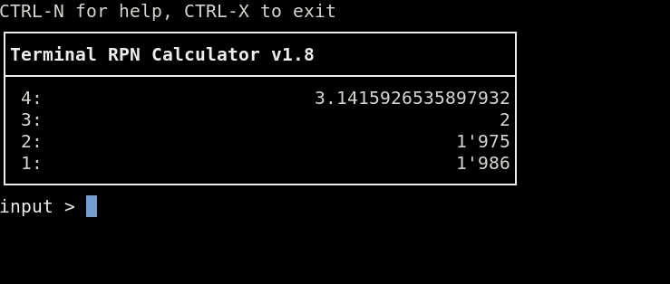

# Terminal RPN Calculator

> an RPN calculator shell for the terminal

## 



## Preface and history 📜

First of all: This calculator is not another exactly emulated Hewlett Packard ™ calculator nor is it using ROM files to provide the full functionality. At the current state, it is not able to store and execute [RPL](https://en.wikipedia.org/wiki/RPL_(programming_language))-programs. Even so, if you are used to those calculators, you might remember and recognize the most useful [commands](https://literature.hpcalc.org/community/hp48sx-qrg-en.pdf).
Lets say, the calculator mimics its great predecessors. In addition to the usual abbreviated commands, these can also be written as full words. Note that some commands are not implemented in the famous calculators but I found them to be useful anyway.

I am using RPN calculators since I was a teenager and still appreciate it. Hence, it is my intention to program a calculator which supports RPN (reverse polish notation) on the one hand and is executable in a terminal on the other hand. It is written in pure python and designed to be a simple and distraction free terminal shell tool with no dependencies. Despite the simple design, it has become a quite powerful calculator with a lot of functions.
(Actually, this calculator has come a long way: I originally planned to create a pure Bash implementation using `bc` in the background, but ultimately decided against it during the implementation process. The current Python implementation is much more powerful and easier to maintain than the original Bash version would have been.)

Again, keep in mind: This is not the real and famous HP42S™ or HP48SX™ that is supporting programming, unit conversions, graphs, equation solvers, libraries and lots of things I do not even know of. Those real calculators are an industrial and technical work of art I admire and may never be compared with.

## Installation 📦

### Linux installation 🐧

* Run `sudo apt install python3` for Debian. Installation for other distributions may vary. There is no other dependencies.
* run `./rpn.py` to start the calculator 🚀
* to install it permanently including man page, run
  * `apt install pandoc`
  * `make`
  * `sudo make install`
* to uninstall it, run `sudo make uninstall`

### Windows installation 🪟️

* install [python](https://www.python.org/downloads/windows/) (Tested with Windows 11 only)
* use `run.bat` to start the calculator or open a cmd-shell and execute `py ./rpn.py` 🚀
* Occasionally, I create an executable file, which can also be used and makes installing Python unnecessary. It is stored in the `bin/` directory.

## Usage 💡

### Disclaimer ⚠️

Don't use this calculator if you plan to fly to the moon. I'm not kidding — expect that some results might be wrong. Testing all functions and edge cases is a huge task.

### General Usage 👇

* If you are not familiar with rpn calculators and with [reverse polish notation](https://en.wikipedia.org/wiki/Reverse_Polish_notation), you might not want to learn this notation unless you know the advantage of this concept and are willing to rethink.
* Typing in either small or capital letters is valid.
* Errors are shown in red and cleared after 2 seconds.
* Decimal numbers are separated by a period.
* the size of the stack is unlimited (in theory).

### User Interface 🖥️

```text
CTRL-N for help, CTRL-X to exit
┌──────────────────────────────────────────────┐
│ Terminal RPN Calculator vX.x.x               │
├──────────────────────────────────────────────┤
│ 4:                                           │
│ 3:                                         64│
│ 2:                                        100│
│ 1:                                      45054│
└──────────────────────────────────────────────┘
input > ▒
```

Example Text User interface above with some numbers entered in the visible stack and cursor after input.

### Hotkeys ⌨️

* CTRL-X → exit
* CTRL-L → clears entire stack
* BACKSPACE →drop stack 1
* DEL → drop stack 1
* CTRL-K → drop actual input >
* TAB → swap stack 1 and stack 2
* ENTER → duplicate stack 1 (if input is empty) else perform the operation or function
* CTRL-E → edit stack 1
* CTRL-N or ? → help

**Hint (ℹ):** If a hotkey is not working, this is most likely due to the terminal shell in use and it's predefined hotkeys. Workaround: enter the according command at the input prompt and hit *ENTER*.

### Commands ⚡

#### Info about commands 📝️

commands are executed by typing in and hit *ENTER*. This might feel rather like a shell therefore.

* Advantages:
  * no polling for keys but just waiting for input.
    * No CPU usage at this point.
    * Simple Code.
    * shell feeling
    * commands should be mostly the sames as the commands of RPN calculators
    * easy to memorize
  * Disadvantages:
    * typing commands for a calculator might feel unusual at first

#### General commands 📢️

* `exit` or `quit` or just `off` followed by hitting the *ENTER*-key to leave the rpn calculator.
* `help` or `?` or `hlp` to get a quite detailed help.
* `about` or `info` to get a little bit info about myself, the calculator and the license
* `refresh` to clear a destroyed UI.
* *`getkey` to check the key code (used for debugging purposes only)*

#### Stack commands 📑

* `clr` or `clear` will clear the entire stack.
* `swap` or `swp` or `x<>y` will swap stack 1 and 2.
* `drop` will delete stack 1.
* `drop2` will delete stack 1 and stack 2.
* `dup` or `duplicate` or `enter` will duplicate stack 1
* `dup2` will duplicate stack1 and stack 2
* `edit` to edit stack 1
* `depth` → number of elements in stack.
* `avg` or `average` → average of entire stack.
* `save` → save entire stack to `~/stack.txt` in decimal values. Windows: `C:\Users\YourUserName\stack.txt`
* `save <filename>` → save entire stack to `~/<filename>` in decimal values
* `sort` → sort entire stack in ascending order and if already, in descending order.
* `sum` → sum of entire stack.
* `rollup` → Moves the very last element of the stack to Level 1 (Bottom to Top).
* `rolldown` → Moves the element from Level 1 to the very bottom of the stack (Top to Bottom).
* `over` → copies stack 2 to stack 1 (without deleting stack 1).
* `pick` → copy stack[n] to top (n from stack 1, 1-based)

#### Basic Arithmetic Operations 🧮

As with the real rpn calculators, hitting the operators does execute an *immediate* operation. You do NOT have to hit the *ENTER*-key to do so.

* `+` or `plus` → addition
* `-` or `minus` → subtraction
* `*` or `mul` → multiplication
* `/` or `:` or `div` → division
* `%` → percentage
* `^` or `pow` → exponentiation (yˣ)
* `_` → changes the sign of a number (+/-)

#### Math functions ƒ(𝑥)

The following functions can be used followed by hitting *ENTER*:

* Sign and basic operation ⊕/⊖
  * `neg` or `chs` → negation
  * `abs`→ absolute value
  * `comb` or `combination(s)` → returns the number of combinations of two numbers in the stack (nCr)
  * `ip` or `int` or `integer` → integer of a given value (by cutting, not rounding)
  * `mant` or `mantissa` → mantissa of a number
  * `xpon` → exponent of argument (floor of log10 of abs value)
  * `fact` or `factorial` → factorial (x! = Γ(x + 1)). Note that the returned value can be very high, as the factorial grows very fast.
  * `frac` or `frac` or `fractional` → fractional part of a number (x - ip(x))
  * `ceil` → returns next greater integer
  * `floor` → returns next smaller integer
  * `mod` or `modulo` → returns modulo of two numbers in the stack
  * `perm` or `permutation(s)` → returns the number of permutations of two numbers in the stack (nPr)
  * `ran` `rand` or `random` → returns random number `0 < x < 1`
  * `rnd` or `round` → Rounds number as specified in level 1.
  * `sign` → sign of x → -1, 0, or 1
  * `gcd` → greatest common divisor
  * `lcm` → least common multiple
* Powers and roots 📈
  * `reci` or `reciprocal` or `inv` → reciproke (1/𝑥)
  * `pow`or `power` → exponentiation (yˣ)
  * `sq` or `square` → square (𝑥²)
  * `sqrt` or `squareroot` → square root (√𝑥)
  * `root` or `rt` or `xroot` → ⁿ√𝑥
  * `exp` → eˣ (inverse of ln)
  * `exp10` or `alog` → 10ˣ (inverse of log10)
  * `expm` → eˣ - 1 (more accurate for small x)
* Logarithms 📏
  * `ln`  → natural (base e) logarithm
  * `log10` or `log` → common logarithm (base 10)
  * `log2` → binary logarithm (base 2)
* Trigonometric functions *(in degrees)* 📐
  * `sin` or `sine` → sine
  * `asin` or `arcsine` → arc sine
  * `sinh` or `sinushyperbolicus` → hyperbolic sine
  * `cos` or `cosine` → cosine
  * `acos` or `arccosine`→ arc cosine
  * `cosh` or `cosinushyperbolicus` → hyperbolic cosine
  * `tan` or `tangent` → tangent
  * `atan` `arctangent` → arc tangent
  * `tanh` `tangenthyperbolicus` → hyperbolic tangent
* Logic operations ✅❌
  * `setwordsize` or `stws` → sets word size for logic ops (the default word size is 64 bits)
  * `recallwordsize` or `rcws` → recalls word size to stack
  * `and` → Logical or binary AND.
  * `or` → Logical or binary OR
  * `xor` → Logical or binary exclusive OR.
  * `not` → Logical or binary NOT.
  * `sl` or `lsl` → logical shift left 1 bit
  * `sr` or `lsr` → logical shift right 1 bit
  * `slb` → shift left 1 byte (8 bits)
  * `srb` → shift right 1 byte (8 bits)
  * `asr` → arithmetic shift right (sign bit replicated)
  * `rl` → rotate left 1 bit
  * `rr` → rotate right 1 bit
  * `rlb` → rotate left 1 byte (8 bits)
  * `rrb` → rotate right 1 byte (8 bits)

#### Constants ◆

The following constants are implemented for now and can be entered followed by hitting *ENTER*:

* `pi` : circle constant (π = 3.1415927…)
* `tau`: "true" circle constant (𝜏 = 2π = 6.2831853…)
* `c` or `lightspeed`: speed of light in a vacuum (𝑐) 299792458 m/s
* `euler` : 2.7182818… (ℯ)
* `gravity` or `g`: 9.80665m/s² (𝑔)
* `phy`or `goldenratio`: 1.6180339887… (φ = (1 + √5) / 2)

#### Memory commands 🧠

* `mem` or `memory` → shows all available memory of the OS, if supported.
* `sto` or `store` will store value of stack 1 into memory and delete the value in the stack.
* `rcl` or `recall` will recall value from memory and append it to the stack. Memory contains `0` by default.
* `mc` or `memclr` or `mclear` will clear the memory and set it to `0`.

### Modes 🔧

#### Display Modes 👁️

* `fix` → Fixed-Decimal (default), will set and show `n` display digits by the stack 1 value.
    E.g. `3 *ENTER* fix *ENTER*` will limit to 3 digits. Allowed value is `0-16`
* `eng` → Engineering notation, will set and show `n` display digits by the stack 1 value
* `sci` → Scientific notation, will set and show `n` display digits by the stack 1 value

#### Base Modes ⚙️

* `dec` will show the stack in *decimal* values
* `hex` will show the stack in *hexadecimal* values
* `bin` will show the stack in *binary* values
* `oct` will show the stack in *octal* values
* the current mode is indicated below the stack at the input prompt if not in *decimal-mode*

##### Notation of dec, hex or bin value(s) ✒️

The notation of a hexadecimal or binary number can be typed in as follows:

* decimal notation of exponential numbers: (e.g. 3e6, 1.5E4, 5.2e-3, 1E+6, 3E-5 …)
* binary: e.g.: `0b1111`, `0b10101010`, …
* hexadecimal : e.g. like `0xabcd`, `0xAFAEBD`, … or directly without leading 0b or 0x.

Further notice 💬:

* **Mixing decimal, hexadecimal and binary values in the stack is not possible.**
* if in decimal mode, all entered values with leading `0x`, `0b` or `0o` are directly converted into the decimal value.
* same behavior and conversion for the other modes

#### Conversion Modes 🪄

##### angle conversions

* `deg2rad` or `d\>r or deg\>rad → Degrees-to-radians conversion.
* `rad2deg` or `r\>d or rad\>deg → radians → degrees

##### temperature conversions

* `c2f` or `c>f` or `°c2°f` or `°c>°f` or `celsius2fahrenheit` : Celsius → Fahrenheit
* `f2c` or `f>c` or `°f2°c` or `°f>°c` or `fahrenheit2celsius` : Fahrenheit → Celsius
* `c2k` or `c>k` or `°c2°k` or `°c>°k` or `celsius2kelvin` : Celsius → Kelvin
* `k2c` or `k>c` or `°k2°c` or `°k>°c` or `kelvin2celsius` : Kelvin → Celsius
* `f2k` or `f>k` or `°f2°k` or `°f>°k` or `fahrenheit2kelvin` : Fahrenheit → Kelvin
* `k2f` or `k>f` or `°k2°f` or `°k>°f` or `kelvin2fahrenheit` : Kelvin → Fahrenheit

Note that values below absolute zero (-273.15°C, -459.67°F or 0 K) are returned as error.

##### time conversions

* `>hms` or `2hms` → decimal hours → H.MMSSss
* `>h` or `2hours` → H.MMSSss → decimal hours

##### length conversions

###### english conversions

* `inch2cm` or `inch>cm`           : inches → centimeters
* `cm2inch` or `cm>inch`           : centimeters → inches
* `inch2mm` or `inch>mm`           : inches → millimeters
* `mm2inch` or `mm>inch`           : millimeters → inches
* `inch2m` or `inch>m`             : inches → meters
* `m2inch` or `m>inch`             : meters → inches
* `foot2m` or `foot>m`             : feet → meters
* `m2foot` or `m>foot`             : meters → feet{RESET}
* `mile2km` or `mile>km`           : miles → kilometers
* `km2mile` or `km>mile`           : kilometers → miles
* `mile2m` or `mile>m`             : miles → meters
* `m2mile` or `m>mile`             : meters → miles
* `seamile2km` or `seamile>km`     : miles → kilometers
* `km2seamile` or `km>seamile`     : kilometers → miles

###### metric conversions

* `km2m` or `km>m`                 : kilometers → meters
* `m2km` or `m>km`                 : meters → kilometers
* `m2cm` or `m>cm`                 : meters → centimeters
* `cm2m` or `cm>m`                 : centimeters → meters
* `m2mm` or `m>mm`                 : meters → millimeters
* `mm2m` or `mm>m`                 : millimeters → meters

###### japanese conversions

* `sun2m` or `sun>m`                 : sun → meters
* `m2sun` or `m>sun`                 : meters → sun
* `ken2m` or `ken>m`                 : ken → meters
* `m2ken` or `m>ken`                 : meters → ken
* `shaku2m` or `shaku>m`             : shaku → meters
* `m2shaku` or `m>shaku`             : meters → shaku
* `shaku2cm` or `shaku>cm`           : shaku → centimeters
* `cm2shaku` or `cm>shaku`           : centimeters → shaku
* `shaku2mm` or `shaku>mm`           : shaku → millimeters
* `mm2shaku` or `mm>shaku`           : millimeters → shaku
* `ri2m` or `ri>m`                   : ri → meters
* `m2ri` or `m>ri`                   : meters → ri

### Limitations ▲ ▼

* the digits are limited and tested to the value **`16`**.

I'm developing this pocket calculator in my spare time, so you'll notice that many features and functions — such as the following — are missing:

* programming
* matrix
* plotting
* variables
* Equation solving
* arrays
* complex number handling
* Unit conversion (some conversions implemented)
* IO and many other fancy features
* small subset of hotkeys — Esc-Key and F-Keys are non-functional

For the moment, I do not have intentions to implement these features. There might be other apropriate tools to use.

### To Do's and Niceties 🚧

The following features are on my to do list:

* missing commands 🕵️
  * incr, decr (increment and decrement stack 1 by 1)
  * sto stack as array elements
  * beep
  * date and time functions (date, date+, ddays)
  * key (would be nice for debugging new hotkeys)
  * max, min, maxr, minr
  * sto+-/* (are those useful commands?)
* missing but cool features 🌟
  * getting track of command-history to implement hotkey "↑" (up) to recall the commands for the "shell-feeling"
  * autocompletion and suggestions
  * status of stored value

## Error reporting 🐛

Errors and bugs are possibly included.
Error reports or corrections are welcome:
✉️  [sery&#x40;solnet.ch](mailto:sery&#x40;solnet.ch)

## Special Thanks 🤝

* Jan Łukasiewicz for inventing [RPN](https://en.wikipedia.org/wiki/Reverse_Polish_notation).
* Bill Joy for his eternal editor [vi](https://en.wikipedia.org/wiki/Vi_(text_editor)) and Bram Moolenaar et al for [Vim](https://www.vim.org), the improved Version of vi for Linux and other platforms.
* Chris Kempson for the wonderful and calm colorscheme [Tomorrow-Night-Blue.vim](https://github.com/chriskempson/tomorrow-theme/blob/master/vim/colors/Tomorrow-Night-Blue.vim).
* John Gruber in collaboration with Aaron Swartz for [Markdown](https://commonmark.org)
* John MacFarlane for the document conversion tool [pandoc](https://github.com/jgm/pandoc/tree/main) that seems to be from outer space with all its functionality.
* Hewlett Packard for the great [calculators](https://en.wikipedia.org/wiki/HP_calculators) (that can be programmed with [RPL](https://en.wikipedia.org/wiki/RPL_(programming_language))) over all the years.
* Bob Bemer for the invention of [ANSI Escape Code](https://en.wikipedia.org/wiki/ANSI_escape_code) that is still supported on many platforms including Windows 11. Unbelievable after all those years!
* Guido van Rossum for inventing the [Python](https://en.wikipedia.org/wiki/Python_(programming_language)) programming language.
* Ken Thompson, Dennis Ritchie, Brian Kernighan, Douglas McIlroy and Joe Ossanna for inventing the [Unix](https://en.wikipedia.org/wiki/Unix) operating system and all the developers who contributed to the Unix ecosystem. Without Unix, Linux would possibly have never been invented.
* Richard Stallman for inventing the [GNU](https://en.wikipedia.org/wiki/GNU) operating system and all the developers who contributed to the GNU ecosystem. Without GNU, Linux would be just a kernel and not a full operating system.
* Linus Torvalds for inventing the [Linux](https://en.wikipedia.org/wiki/Linux) operating system kernel and all the developers who contributed to the Linux ecosystem.

## see also

**bc**(1), **dc**(1)
