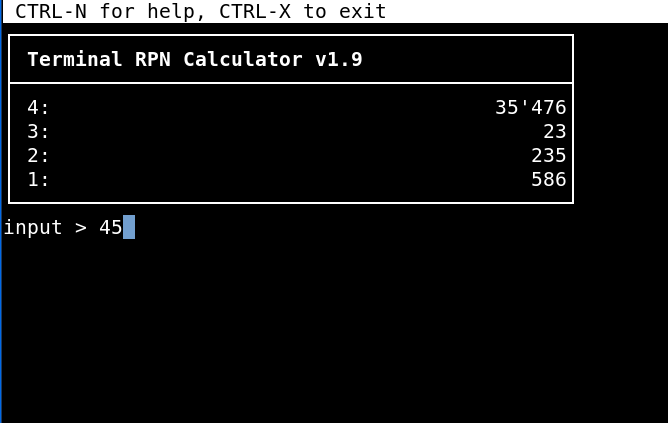

# Terminal RPN Calculator

I left github for good. You can download directly from my own website.

&rarr;[Terminal RPN Calculator](https://klangwerkbank.ch/software/rpncalc/index.html)

## Screenshots

